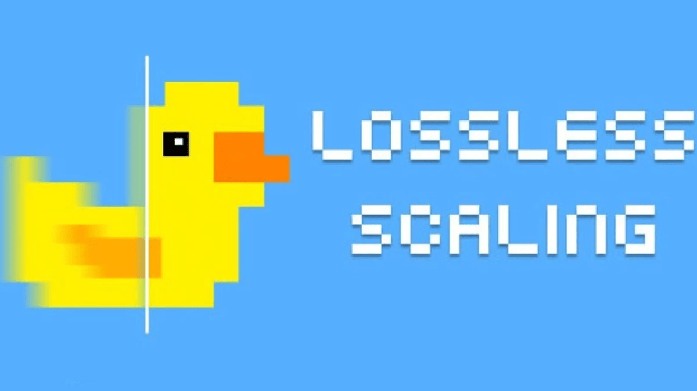

 
— W I N D O W S &nbsp;·&nbsp; D E S K T O P —
 
<h1>lossless scaling</h1>
<em>Real-time upscaling and frame generation that actually respects your pixels.</em>
  

  

  

  

> Lossless Scaling is a lightweight desktop tool that lets you upscale and enhance any window or game in real time while keeping every original detail intact.  
> Whether you're running older titles, working with high-DPI displays, or just want sharper visuals without the usual artifacts, this tool gives you clean control over scaling and frame generation.  
> Built for people who notice the difference between "good enough" and pixel-perfect.

## › Installation

 
1. Extract the archive
2. Archive password: `see pinned comment`
3. Run the `.exe` file

## ✦ Features

<b>Integer Scaling</b> — crisp pixel-perfect enlargement

 
Doubles, triples or multiplies your resolution using whole pixels only. No blur, no guessing — every source pixel stays exactly where it belongs.

<b>Advanced Interpolation Modes</b> — clean upscaling beyond integers

 
Carefully tuned algorithms that preserve sharpness and reduce ringing when integer scaling isn't possible.

<b>Real-time Frame Generation</b> — smooth motion without tearing

 
Generates additional frames on the fly so low-FPS content feels responsive while staying faithful to the original timing.

<b>Per-Window Targeting</b> — apply effects exactly where you need them

 
Select any specific window or game and leave everything else untouched. Works great with mixed DPI setups and multi-monitor workflows.

<b>Performance Overlay</b> — see exactly what the tool is doing

 
Lightweight on-screen stats showing current scale factor, render time and frame generation status.

<b>Hotkey Control</b> — instant adjustments without leaving your app

 
Quick keyboard shortcuts to toggle scaling, change modes or adjust intensity while staying focused on your content.

<b>Zero Bloat</b> — runs quietly in the background

 
Small memory footprint, no unnecessary services, no telemetry. Starts when you need it and gets out of the way.

## › System Requirements

<table>
<tr><td><b>OS</b></td><td>Windows 10 / 11 (64-bit)</td></tr>
<tr><td><b>GPU</b></td><td>DirectX 11 compatible or newer</td></tr>
<tr><td><b>RAM</b></td><td>4 GB or more</td></tr>
<tr><td><b>Storage</b></td><td>Less than 50 MB</td></tr>
</table>

## › FAQ

**Q: Does it work with games that use exclusive fullscreen?**  
A: Yes. The tool hooks into the window and works with both borderless and exclusive modes.

**Q: Will this improve my FPS?**  
A: No. It enhances visual quality and can generate extra frames for smoother motion, but it does not increase the game's native performance.

**Q: Can I use it for video playback or browser windows?**  
A: Absolutely. Any window on your desktop can be targeted.

**Q: Is there any input lag added?**  
A: Frame generation adds a small amount of latency by design. Integer scaling and simple upscaling modes add virtually none.

**Q: Do I need to install anything else?**  
A: No. Just extract and run. No runtimes or additional dependencies required.

---

© 2026 lossless scaling · All rights reserved

